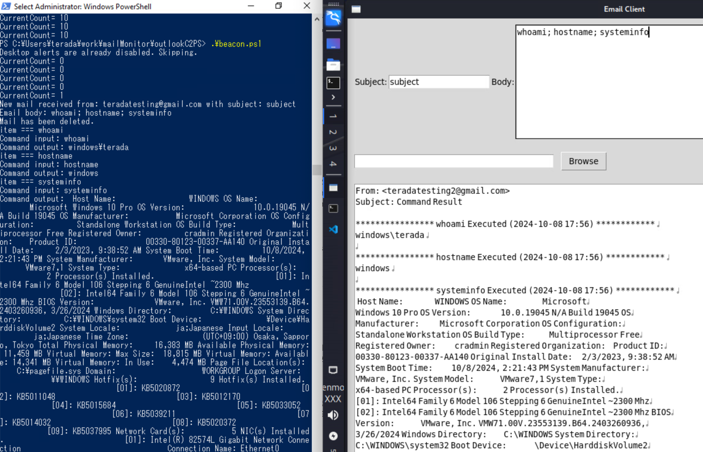
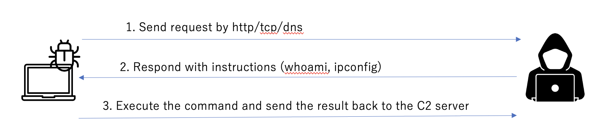
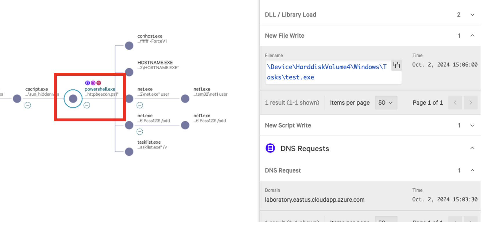
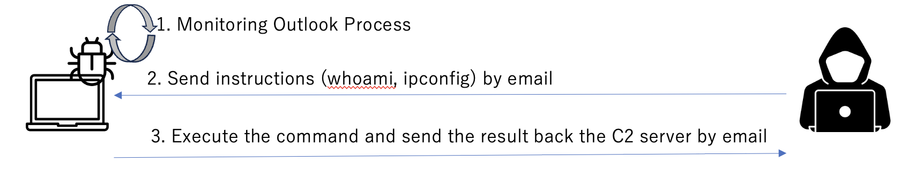
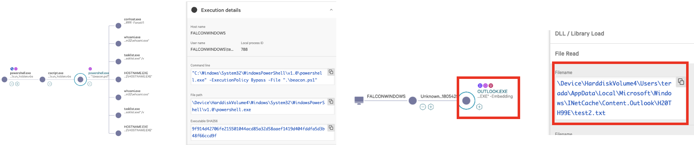
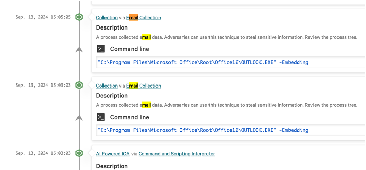

# outlookC2

This is a C2 framework utilizing Outlook for testing purposes. By running outlookBeacon.ps1 on the workstation with Outlook executed and outlookC2Server.py on the server side, you can communicate with the C2 via Outlook emails.


I think that many malwares and C2 frameworks utilize HTTP/HTTPS or DNS for communication, that's why C2 communications using SMTP/IMAP are not given much attention compared to http/https/dns. However, there are indeed some malware and actors that utilize SMTP/IMAP for C2 communications (ex AgentTesla, Emotet, APT28, etc), although they are relatively few. There are three email collection techniques according to MITRE ATT&CK. 

- Local Email Collection
- Remote Email Collection
- Email Forwarding Rule

Additionally, there are cases where C2 communications via SMTP/IMAP can pose threats and vulnerabilities. For example, under the environment using a security solution like web isolation, direct HTTP/HTTPS outbound traffics from the workstations to the internet can be blocked. In such environments, malware that uses SMTP/IMAP for C2 communications can be a significant threat to bypass web isolated environment.

Since PowerShell can control Outlook, this C2 framework operates the Outlook on the workstation to communicate with the server. The reason for using Outlook is that it is the most commonly used email software in businesses, especially in large organizations that can implement web isolation.

## How to Use
### workstation

Please execute outlookBeacon.ps1 or compile and run the .NET source code. The email address used as the C2 server is set in the variable serverAddress, so please change it to the email address you intend to use.

`$serverAddress = "attackerSender@testmail.com"`

`.\outlookBeacon.ps1`


### Server
Even without starting the server, it can function as a C2 simply by sending emails to the victim's email address from Gmail or something. However, sending emails each time can be cumbersome, and to simulate an interactive shell, I created a simple GUI tool.

The authentication information is specified in outlookC2Server.py, so please set the credentials for the email address you wish to send emails to.


```
smtp_server = 'smtp.gmail.com'
imap_server = 'imap.gmail.com'
port = 587
#username = input("Your email address: ")
username = "attackerSender@testmail.com"
password = getpass.getpass('Password: ')
#recipient = input("Target email address: ")
recipient = "victimRecipient@testmail.com"
```

`python3 outlookC2Server.py`



## Supported C2 Commands

| C2 Command           | Description                                                                                      |
|----------------------|--------------------------------------------------------------------------------------------------|
| Download {Filepath}  | Attach the specified file and send it to the C2 address via email.                             |
| {Filepath} in the attachment field            | Attach the specified file and send it to the victim address, which is located at C:\Windows\Tasks. |
| search {Keyword}     | Search for emails containing the specified keyword in the inbox.                                 |
| forward              | Create a rule to forward all incoming emails to the C2 address.                                 |
| listFolders            | Retrieve all inbox folders and send the results to the C2 address.                              |
| getFolders {FolderName}            | Compress the emails in the folder named FolderName into a zip file and send it to the C2 address.                              |
| Other                | Execute PowerShell commands and email the results to the C2 address, e.g., whoami, ipconfig.   |

You can send multiple commands separated by commas.
`whoami; listFolders; net user`


## Process Flow of outlookBeacon.ps1

1. Modify the registry to turn off Outlook notifications.
2. Monitor the running Outlook to check if there are any emails from the configured address (C2 address).
3. Execute commands according to the received C2 commands and send the results back to the C2 address via email.
4. Delete emails sent to and received from the C2 address.


## Detection by AV/EDR

No detection by AV (Windows Defender), and no detection by EDR which I tested. 

Due to the complexity of detection algorithms in EDR, it is difficult to test EDR, but I think it is generally more difficult to detect outlookC2 compared to general HTTP/HTTPS/DNS/TCP reverse shells.


### Process Flow of a generall Reverse Shell
The general process flow of a reverse shell operation is as follows:

1. reverse shell sends a request to the C2 server regularly
2. C2 server responds with a command
3. reverse shell executes the command and sends the result back to the C2 server

In step 1, it is common for the malware to generate requests to the C2 server at regular intervals (the length of the sleep period is often configurable). 



Additionally, when downloadng additional files, the malware itself or processes commonly used by malware, such as wget, bitsadmin, or certutil are used for writing the files. This can lead to detection by antivirus software or EDR because of DNS/http traffics or DISC IO (the parent process can be altered through techniques like injection).




### Process flow of outlookC2

As mentioned earlier, outlookC2 only monitors the outlook  process and does not generate regular traffic with the C2 server. 



Regarding the writing of additional files, since the writing operation is done by Outlook which is not suspicious for writing, the likelihood of detection by antivirus software is also considered low. Furthermore, because it utilizes the already running Outlook process on the workstation, there is no need for SMTP server credentials, and no suspicious DNS communications will be generated from the workstation.




## Disadvantage of outlookC2

Firstly, it is slower compared to HTTP/HTTPS reverse shells. This is an unavoidable characteristic due to the nature of email.

One disadvantage is that, although I have added functionality to turn off notifications, some email software may not allow this and some users may notice suspicious email which contains some powershell commands. In this regard, one approach is to attach images to advertisement emails that users are likely to ignore, embedding instructions from the C2 using techniques such as steganography, and sending emails that do not raise suspicion (future work).

Another disadvantage is that some companies may restrict the email address domains to which they send emails (for example, free email addresses like Gmail). In this case, it will be necessary to send emails using compromised credentials from domains like those used in a botnet.


## Detection Rules

Perhaps due to the limited cases of using SMTP/IMAP for C2 communications, there are fewer detection rules compared to HTTP/HTTPS/DNS. However, some of the existing detection rules are as follows.

- Splunk (Gsuite Outbound Email With Attachment To External Domain)

https://research.splunk.com/cloud/dc4dc3a8-ff54-11eb-8bf7-acde48001122/

- Elastic (Suspicious Inter-Process Communication via Outlook)

https://www.elastic.co/guide/en/security/current/suspicious-inter-process-communication-via-outlook.html

- EDR

Depending on the EDR, there may be cases where Email Collection attacks are detected. For example, CrowdStrike has detected them in some cases. However, there are also cases where they don't detect, so it is important to consider detection mechanisms beyond just EDR.




## Reference lists

- BadOutlook

Most similar, but not specific for Web Isolated Environment.
A simple PoC which leverages the Outlook Application Interface (COM Interface) to execute shellcode on a system based on a specific trigger subject line


https://github.com/aahmad097/BadOutlook

- SharpGmailC2

Abuse Gmail process for C2 communications via smtp and imap. 


https://github.com/reveng007/SharpGmailC2

- AzureOutlookC2 (2021)

Uses Microsoft Graph API for C2 communications & data exfiltration.


https://github.com/boku7/azureOutlookC2

- Sans Article

An article on the technical explanation and precautions for C2 communication using Outlook.

https://isc.sans.edu/diary/29180
